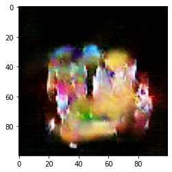

# Pokemon Generator

A DCGAN to generate Pokemon. The dataset I have used has ~2800 images shrunk down to (100, 100) from the original size, and each model has been trained over 50 epochs.

(I have used a smaller dataset as GitHub has a file size limit of 100MB)

The original dataset that consists of ~11,000 images can be found [here](https://www.kaggle.com/thedagger/pokemon-generation-one)

## Images

Here are a few images generated across a couple of models.

    
    
    
    

## Models

1. - Learning rate 1e-4
   - Adam optimizer for both generator and discriminator

   

       
       
       
       
   

2. - Learning rate 1e-4
   - Adam optimizer for generator and SGD optimizer for discriminator

   

       
       
       
       
       
       
   

3. - Learning rate 1e-4
   - Adam optimizer with momentum = 0.5 for generator
   - SGD optimizer for discriminator

   

       
       
       
       
       
       
       
       
   

## Graphs

The graphs for the different models over 50 epochs can be found [here](https://github.com/KulkarniKaustubh/PokeGAN/tree/master/results/graphs)

## Code

Code is in the [src folder](https://github.com/KulkarniKaustubh/PokeGAN/tree/master/src)
